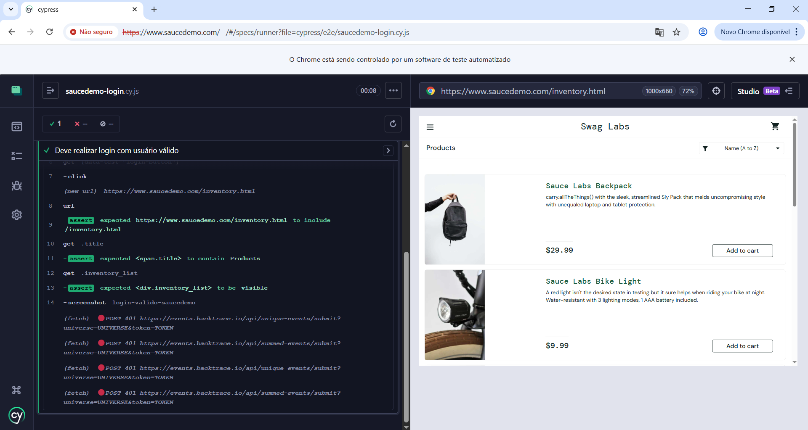
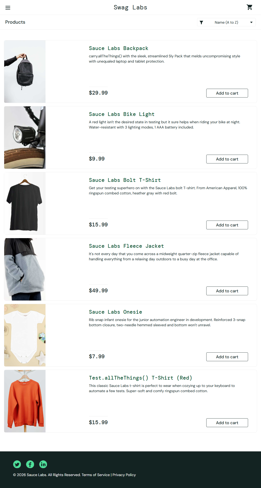

# QA Cypress Lab

Projeto de portfólio criado para praticar e documentar testes automatizados end-to-end com Cypress.

O objetivo deste projeto é demonstrar uma suíte de automação web cobrindo fluxos reais de uma aplicação de e-commerce de treino, com validações, evidências e execução completa via terminal.

## Tecnologias utilizadas

- Cypress
- JavaScript
- Node.js
- npm
- SauceDemo
- VS Code
- Git e GitHub

## Sistema utilizado para teste

Aplicação: [SauceDemo](https://www.saucedemo.com/)

O SauceDemo é uma aplicação web utilizada para estudos de QA, permitindo praticar fluxos como login, carrinho e checkout.

## Escopo da automação

A suíte automatizada cobre os seguintes fluxos:

- Login com usuário válido;
- Login com usuário inválido;
- Login com usuário bloqueado;
- Adição de produto ao carrinho;
- Validação de produto no carrinho;
- Checkout completo;
- Execução da suíte completa em modo headless.

## Estrutura do projeto

```text
qa-cypress-lab
├── cypress
│   ├── e2e
│   │   ├── saucedemo-login.cy.js
│   │   ├── saucedemo-cart.cy.js
│   │   └── saucedemo-checkout.cy.js
│   ├── fixtures
│   ├── support
│   ├── cypress.config.js
│   ├── package.json
│   └── package-lock.json
├── docs
│   └── evidencias
│       └── cypress
│           ├── login-valido-teste-passando.png
│           ├── login-valido-saucedemo.png
│           ├── login-invalido-teste-passando.png
│           ├── login-invalido-saucedemo.png
│           ├── login-usuario-bloqueado-teste-passando.png
│           ├── login-usuario-bloqueado-saucedemo.png
│           ├── produto-adicionado-carrinho-teste-passando.png
│           ├── produto-adicionado-carrinho-saucedemo.png
│           ├── validacao-carrinho-teste-passando.png
│           ├── validacao-carrinho-saucedemo.png
│           ├── checkout-completo-teste-passando.png
│           ├── checkout-completo-saucedemo.png
│           └── suite-completa-cypress-passando.png
├── .gitignore
└── README.md
```

## Como executar o projeto

Acesse a pasta do Cypress:

```bash
cd cypress
```

Instale as dependências, caso necessário:

```bash
npm install
```

Para abrir o Cypress em modo interativo:

```bash
npx cypress open
```

Para executar toda a suíte em modo headless:

```bash
npx cypress run
```

Para executar um arquivo específico:

```bash
npx cypress run --spec "e2e/saucedemo-login.cy.js"
```

```bash
npx cypress run --spec "e2e/saucedemo-cart.cy.js"
```

```bash
npx cypress run --spec "e2e/saucedemo-checkout.cy.js"
```

## Arquivos de teste

### Login

Arquivo:

```text
cypress/e2e/saucedemo-login.cy.js
```

Cenários cobertos:

- Login válido;
- Login inválido;
- Login com usuário bloqueado.

### Carrinho

Arquivo:

```text
cypress/e2e/saucedemo-cart.cy.js
```

Cenários cobertos:

- Adicionar produto ao carrinho;
- Validar contador do carrinho;
- Validar produto, preço e botão de checkout na página do carrinho.

### Checkout

Arquivo:

```text
cypress/e2e/saucedemo-checkout.cy.js
```

Cenário coberto:

- Realizar checkout completo com sucesso.

## Cenários automatizados

### CT-01 - Login válido

**Objetivo:** validar que um usuário com credenciais corretas consegue acessar a página de produtos.

**Dados utilizados:**

| Campo | Valor |
|---|---|
| Usuário | `standard_user` |
| Senha | `secret_sauce` |

**Validações realizadas:**

- Redirecionamento para `/inventory.html`;
- Exibição do título `Products`;
- Exibição da lista de produtos.

**Evidências:**

```text
docs/evidencias/cypress/login-valido-teste-passando.png
docs/evidencias/cypress/login-valido-saucedemo.png
```

### CT-02 - Login inválido

**Objetivo:** validar que o sistema exibe mensagem de erro ao tentar login com credenciais inválidas.

**Dados utilizados:**

| Campo | Valor |
|---|---|
| Usuário | `usuario_invalido` |
| Senha | `senha_invalida` |

**Validações realizadas:**

- Exibição da mensagem de erro;
- Permanência do usuário na tela de login.

**Evidências:**

```text
docs/evidencias/cypress/login-invalido-teste-passando.png
docs/evidencias/cypress/login-invalido-saucedemo.png
```

### CT-03 - Login com usuário bloqueado

**Objetivo:** validar que o sistema bloqueia o acesso de um usuário impedido de realizar login.

**Dados utilizados:**

| Campo | Valor |
|---|---|
| Usuário | `locked_out_user` |
| Senha | `secret_sauce` |

**Validações realizadas:**

- Exibição da mensagem de usuário bloqueado;
- Permanência do usuário na tela de login.

**Evidências:**

```text
docs/evidencias/cypress/login-usuario-bloqueado-teste-passando.png
docs/evidencias/cypress/login-usuario-bloqueado-saucedemo.png
```

### CT-04 - Adicionar produto ao carrinho

**Objetivo:** validar que um produto pode ser adicionado ao carrinho com sucesso.

**Produto utilizado:**

| Produto | Valor |
|---|---|
| Sauce Labs Backpack | `$29.99` |

**Validações realizadas:**

- Clique no botão `Add to cart`;
- Exibição do contador do carrinho com valor `1`;
- Alteração do botão para `Remove`.

**Evidências:**

```text
docs/evidencias/cypress/produto-adicionado-carrinho-teste-passando.png
docs/evidencias/cypress/produto-adicionado-carrinho-saucedemo.png
```

### CT-05 - Validar produto na página do carrinho

**Objetivo:** validar que o produto adicionado aparece corretamente na página do carrinho.

**Validações realizadas:**

- Redirecionamento para `/cart.html`;
- Exibição do título `Your Cart`;
- Exibição do produto `Sauce Labs Backpack`;
- Exibição do preço `$29.99`;
- Exibição do botão `Checkout`.

**Evidências:**

```text
docs/evidencias/cypress/validacao-carrinho-teste-passando.png
docs/evidencias/cypress/validacao-carrinho-saucedemo.png
```

### CT-06 - Checkout completo

**Objetivo:** validar o fluxo completo de compra, desde o carrinho até a finalização do pedido.

**Dados utilizados:**

| Campo | Valor |
|---|---|
| Nome | `Bruno` |
| Sobrenome | `Ramos` |
| CEP | `72000-000` |

**Validações realizadas:**

- Acesso à etapa de informações do checkout;
- Preenchimento dos dados do comprador;
- Acesso à tela de resumo da compra;
- Validação do produto no resumo;
- Validação do preço;
- Finalização da compra;
- Exibição da mensagem `Thank you for your order!`.

**Evidências:**

```text
docs/evidencias/cypress/checkout-completo-teste-passando.png
docs/evidencias/cypress/checkout-completo-saucedemo.png
```

## Resultado da suíte completa

A suíte foi executada via terminal com o comando:

```bash
npx cypress run
```

Resultado obtido:

```text
saucedemo-cart.cy.js        3 testes passando
saucedemo-checkout.cy.js    1 teste passando
saucedemo-login.cy.js       3 testes passando

Total: 7 testes passando
```

**Evidência da execução completa:**

```text
docs/evidencias/cypress/suite-completa-cypress-passando.png
```


## Evidências visuais

### Login válido





### Login inválido


### Usuário bloqueado


### Carrinho


### Checkout


## Configuração do Cypress

Arquivo:

```text
cypress/cypress.config.js
```

Configuração utilizada:

```javascript
const { defineConfig } = require('cypress');

module.exports = defineConfig({
  e2e: {
    specPattern: 'e2e/**/*.cy.js',
    supportFile: false,
    screenshotsFolder: 'screenshots',
    videosFolder: 'videos'
  }
});
```

## Boas práticas aplicadas

- Separação dos testes por fluxo funcional;
- Uso de seletores estáveis com `data-test`;
- Validações de URL, textos, elementos visíveis e fluxo de navegação;
- Geração de evidências automáticas com `cy.screenshot`;
- Organização das evidências em pasta específica para documentação;
- Execução da suíte completa via terminal;
- Controle de arquivos temporários com `.gitignore`.

## Observações

As evidências automáticas geradas pelo Cypress foram copiadas para a pasta:

```text
docs/evidencias/cypress
```

A pasta automática de screenshots do Cypress foi adicionada ao `.gitignore`, evitando versionar arquivos temporários gerados durante a execução local.

## Status do projeto

Concluído nesta etapa.

Suíte automatizada Cypress criada, organizada, executada e documentada com sucesso.

## Próximas melhorias possíveis

- Criar comandos customizados para login;
- Utilizar fixtures para massa de dados;
- Adicionar testes negativos no checkout;
- Executar testes em pipeline de CI/CD;
- Implementar a mesma suíte utilizando Selenium WebDriver;
- Criar um projeto complementar com Playwright.
