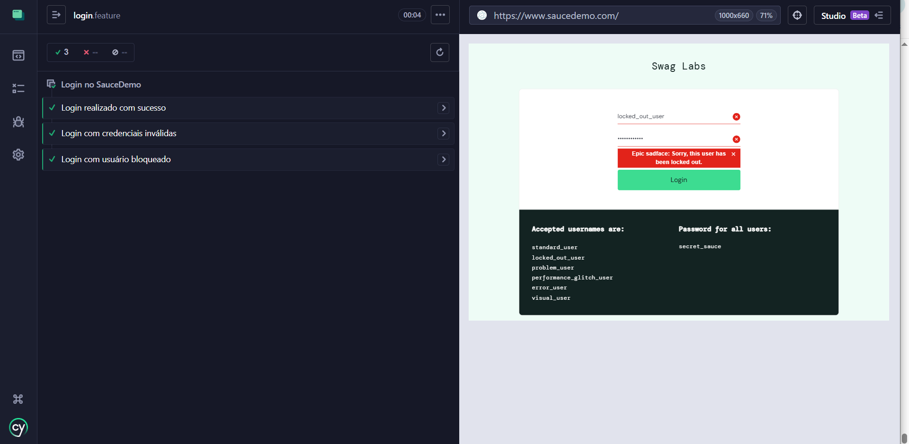
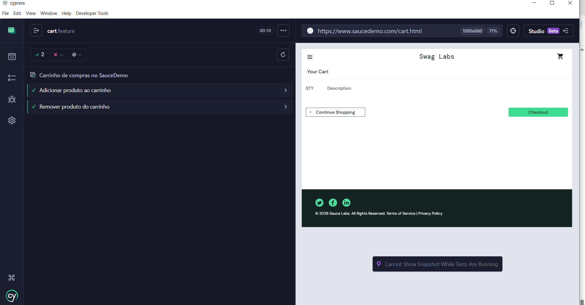
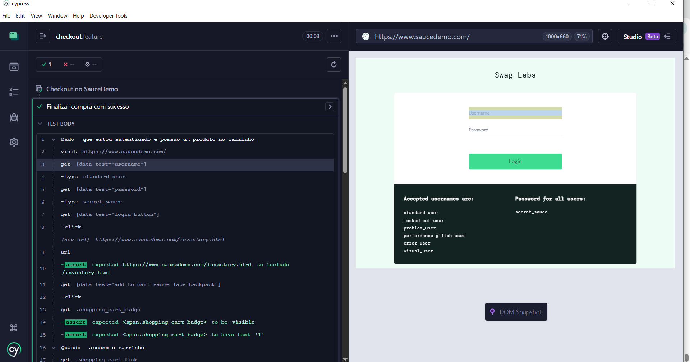
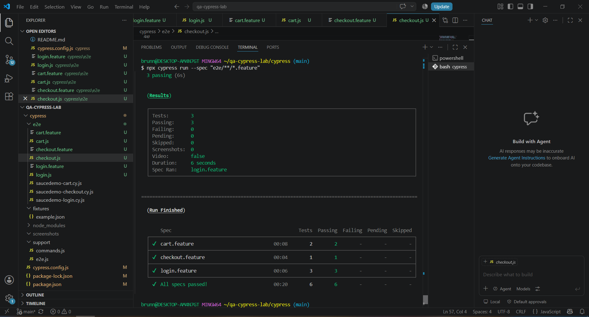
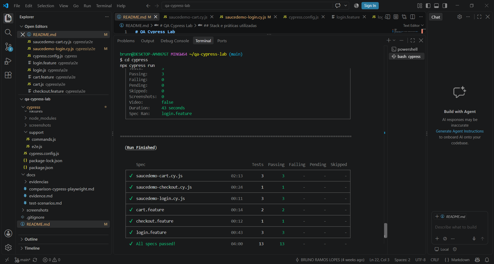

# QA Cypress Lab

Projeto de portfólio desenvolvido para praticar e documentar testes automatizados end-to-end com Cypress, incluindo automação tradicional e cenários escritos com BDD utilizando Gherkin e Cucumber.

O objetivo do projeto é demonstrar uma suíte de automação web cobrindo fluxos críticos de uma aplicação de e-commerce de treino, com cenários positivos e negativos, validações funcionais, documentação, evidências e execução completa via terminal.

## Tecnologias utilizadas

- Cypress
- JavaScript
- Node.js
- npm
- BDD
- Gherkin
- Cucumber
- `@badeball/cypress-cucumber-preprocessor`
- esbuild
- SauceDemo
- VS Code
- Git e GitHub

## Sistema utilizado para teste

Aplicação: [SauceDemo](https://www.saucedemo.com/)

O SauceDemo é uma aplicação web utilizada para estudos de Quality Assurance, permitindo validar fluxos como autenticação, catálogo de produtos, carrinho e checkout.

## Escopo da automação

A suíte cobre os seguintes fluxos:

- Login com usuário válido;
- Login com credenciais inválidas;
- Login com usuário bloqueado;
- Adição de produto ao carrinho;
- Validação de produto no carrinho;
- Remoção de produto do carrinho;
- Checkout completo;
- Cenários descritos em BDD com Gherkin;
- Execução de testes tradicionais Cypress e testes BDD;
- Execução completa da suíte em modo headless.

## Estratégia de automação

O projeto possui duas abordagens de testes automatizados trabalhando em conjunto.

### Cypress tradicional

Testes escritos diretamente em JavaScript utilizando a estrutura padrão do Cypress:

```text
saucedemo-login.cy.js
saucedemo-cart.cy.js
saucedemo-checkout.cy.js
```

### Cypress com BDD

Cenários de negócio descritos em arquivos `.feature` utilizando Gherkin e implementados com Cucumber:

```text
login.feature
cart.feature
checkout.feature
```

As definições dos passos são implementadas em:

```text
login.js
cart.js
checkout.js
```

Essa estrutura permite separar a descrição do comportamento esperado da implementação técnica dos testes.

## Estrutura do projeto

```text
qa-cypress-lab
├── cypress
│   ├── e2e
│   │   ├── saucedemo-login.cy.js
│   │   ├── saucedemo-cart.cy.js
│   │   ├── saucedemo-checkout.cy.js
│   │   ├── login.feature
│   │   ├── login.js
│   │   ├── cart.feature
│   │   ├── cart.js
│   │   ├── checkout.feature
│   │   └── checkout.js
│   ├── fixtures
│   ├── support
│   ├── cypress.config.js
│   ├── package.json
│   └── package-lock.json
├── docs
│   └── evidencias
│       └── cypress
│           ├── login-valido-teste-passando.png
│           ├── login-valido-saucedemo.png
│           ├── login-invalido-teste-passando.png
│           ├── login-invalido-saucedemo.png
│           ├── login-usuario-bloqueado-teste-passando.png
│           ├── login-usuario-bloqueado-saucedemo.png
│           ├── produto-adicionado-carrinho-teste-passando.png
│           ├── produto-adicionado-carrinho-saucedemo.png
│           ├── validacao-carrinho-teste-passando.png
│           ├── validacao-carrinho-saucedemo.png
│           ├── checkout-completo-teste-passando.png
│           ├── checkout-completo-saucedemo.png
│           ├── suite-completa-cypress-passando.png
│           ├── bdd-login-3-cenarios.png
│           ├── bdd-carrinho-cenarios.png
│           ├── bdd-checkout-cenario.png
│           ├── bdd-suite-completa.png
│           └── suite-completa-cypress-bdd-13-testes.png
├── .gitignore
└── README.md
```

## Como executar o projeto

Acesse a pasta do Cypress:

```bash
cd cypress
```

Instale as dependências:

```bash
npm install
```

### Abrir o Cypress em modo interativo

```bash
npm run cypress:open
```

ou:

```bash
npx cypress open
```

### Executar toda a suíte

```bash
npx cypress run
```

Esse comando executa os testes tradicionais `.cy.js` e os cenários BDD `.feature`.

### Executar somente os testes BDD

```bash
npx cypress run --spec "e2e/**/*.feature"
```

### Executar um teste tradicional específico

```bash
npx cypress run --spec "e2e/saucedemo-login.cy.js"
```

```bash
npx cypress run --spec "e2e/saucedemo-cart.cy.js"
```

```bash
npx cypress run --spec "e2e/saucedemo-checkout.cy.js"
```

### Executar uma feature específica

```bash
npx cypress run --spec "e2e/login.feature"
```

```bash
npx cypress run --spec "e2e/cart.feature"
```

```bash
npx cypress run --spec "e2e/checkout.feature"
```

# Testes tradicionais Cypress

## Login

Arquivo:

```text
cypress/e2e/saucedemo-login.cy.js
```

Cenários:

- Login válido;
- Login inválido;
- Login com usuário bloqueado.

## Carrinho

Arquivo:

```text
cypress/e2e/saucedemo-cart.cy.js
```

Cenários:

- Adicionar produto ao carrinho;
- Validar contador do carrinho;
- Validar produto, preço e botão de checkout.

## Checkout

Arquivo:

```text
cypress/e2e/saucedemo-checkout.cy.js
```

Cenário:

- Realizar checkout completo com sucesso.

# Cenários BDD

Os cenários BDD foram escritos em português utilizando a estrutura:

```gherkin
Dado
Quando
E
Então
```

## Feature: Login

Arquivo:

```text
cypress/e2e/login.feature
```

Cenários:

1. Login realizado com sucesso;
2. Login com credenciais inválidas;
3. Login com usuário bloqueado.

Exemplo:

```gherkin
Cenário: Login realizado com sucesso
  Dado que estou na página de login do SauceDemo
  Quando informo usuário e senha válidos
  E clico no botão de login
  Então devo visualizar a página de produtos
```

**Evidência:**

```text
docs/evidencias/cypress/bdd-login-3-cenarios.png
```



## Feature: Carrinho

Arquivo:

```text
cypress/e2e/cart.feature
```

Cenários:

1. Adicionar produto ao carrinho;
2. Remover produto do carrinho.

Foi utilizado `Contexto` para definir a pré-condição comum de autenticação.

**Evidência:**

```text
docs/evidencias/cypress/bdd-carrinho-cenarios.png
```



## Feature: Checkout

Arquivo:

```text
cypress/e2e/checkout.feature
```

Cenário:

1. Finalizar compra com sucesso.

O fluxo automatizado contempla:

- autenticação;
- inclusão do produto no carrinho;
- acesso ao checkout;
- preenchimento dos dados obrigatórios;
- revisão do pedido;
- finalização da compra;
- validação da confirmação do pedido.

**Evidência:**

```text
docs/evidencias/cypress/bdd-checkout-cenario.png
```



# Cenários automatizados tradicionais

## CT-01 - Login válido

**Objetivo:** validar que um usuário com credenciais corretas consegue acessar a página de produtos.

| Campo | Valor |
|---|---|
| Usuário | `standard_user` |
| Senha | `secret_sauce` |

**Validações:**

- Redirecionamento para `/inventory.html`;
- Exibição do título `Products`;
- Exibição da lista de produtos.

## CT-02 - Login inválido

**Objetivo:** validar que o sistema exibe mensagem de erro ao tentar login com credenciais inválidas.

| Campo | Valor |
|---|---|
| Usuário | `usuario_invalido` |
| Senha | `senha_invalida` |

**Validações:**

- Exibição da mensagem de erro;
- Permanência na tela de login.

## CT-03 - Login com usuário bloqueado

**Objetivo:** validar que um usuário bloqueado não consegue acessar o sistema.

| Campo | Valor |
|---|---|
| Usuário | `locked_out_user` |
| Senha | `secret_sauce` |

**Validações:**

- Exibição da mensagem de usuário bloqueado;
- Permanência na tela de login.

## CT-04 - Adicionar produto ao carrinho

**Objetivo:** validar que um produto pode ser adicionado ao carrinho.

| Produto | Valor |
|---|---|
| Sauce Labs Backpack | `$29.99` |

**Validações:**

- Clique em `Add to cart`;
- Contador do carrinho com valor `1`;
- Alteração do botão para `Remove`.

## CT-05 - Validar produto no carrinho

**Objetivo:** validar que o produto adicionado aparece corretamente no carrinho.

**Validações:**

- Redirecionamento para `/cart.html`;
- Exibição do título `Your Cart`;
- Exibição do produto `Sauce Labs Backpack`;
- Exibição do preço `$29.99`;
- Exibição do botão `Checkout`.

## CT-06 - Checkout completo

**Objetivo:** validar o fluxo completo de compra.

| Campo | Valor |
|---|---|
| Nome | `Bruno` |
| Sobrenome | `Ramos` |
| CEP | `72000-000` |

**Validações:**

- Acesso ao checkout;
- Preenchimento dos dados;
- Acesso ao resumo da compra;
- Validação do produto;
- Validação do preço;
- Finalização da compra;
- Exibição da mensagem `Thank you for your order!`.

# Resultado dos testes BDD

Execução realizada com:

```bash
npx cypress run --spec "e2e/**/*.feature"
```

Resultado:

```text
cart.feature        2 testes passando
checkout.feature    1 teste passando
login.feature       3 testes passando

Total: 6 testes passando
```

**Resultado:**

```text
All specs passed!
```

**Evidência:**

```text
docs/evidencias/cypress/bdd-suite-completa.png
```



# Resultado da suíte completa

Após a implementação do BDD, a suíte tradicional e os novos cenários foram executados em conjunto.

Comando:

```bash
npx cypress run
```

Resultado:

```text
saucedemo-cart.cy.js        3 testes passando
saucedemo-checkout.cy.js    1 teste passando
saucedemo-login.cy.js       3 testes passando
cart.feature                2 testes passando
checkout.feature            1 teste passando
login.feature               3 testes passando

Total: 13 testes passando
```

**Resultado final:**

```text
All specs passed!
13 passing
0 failing
```

Essa execução demonstra que a implementação de BDD foi adicionada sem comprometer os testes Cypress existentes.

**Evidência principal:**

```text
docs/evidencias/cypress/suite-completa-cypress-bdd-13-testes.png
```



# Configuração do Cypress

Arquivo:

```text
cypress/cypress.config.js
```

Configuração atual:

```javascript
const { defineConfig } = require('cypress');
const createBundler = require('@bahmutov/cypress-esbuild-preprocessor');

const {
  addCucumberPreprocessorPlugin
} = require('@badeball/cypress-cucumber-preprocessor');

const {
  createEsbuildPlugin
} = require('@badeball/cypress-cucumber-preprocessor/esbuild');

module.exports = defineConfig({
  e2e: {
    specPattern: [
      'e2e/**/*.cy.js',
      'e2e/**/*.feature'
    ],

    supportFile: false,

    screenshotsFolder: 'screenshots',
    videosFolder: 'videos',

    async setupNodeEvents(on, config) {
      await addCucumberPreprocessorPlugin(on, config);

      on(
        'file:preprocessor',
        createBundler({
          plugins: [createEsbuildPlugin(config)]
        })
      );

      return config;
    }
  }
});
```

Essa configuração permite que os testes tradicionais `.cy.js` e os arquivos BDD `.feature` sejam executados no mesmo projeto.

# Boas práticas aplicadas

- Separação dos testes por fluxo funcional;
- Cenários BDD escritos em Gherkin;
- Uso de `Dado`, `Quando`, `E` e `Então`;
- Separação entre arquivos `.feature` e step definitions;
- Utilização de `Contexto` para pré-condições compartilhadas;
- Uso de seletores estáveis com `data-test`;
- Cenários positivos e negativos;
- Validação de URL, textos, elementos e navegação;
- Validação de mensagens de erro;
- Organização das evidências por tecnologia;
- Execução individual e completa das suítes;
- Execução headless via terminal;
- Compatibilidade entre testes Cypress tradicionais e BDD;
- Controle de arquivos temporários com `.gitignore`;
- Versionamento com Git e GitHub.

# Evidências

As evidências utilizadas na documentação estão organizadas em:

```text
docs/evidencias/cypress
```

Entre as principais evidências da implementação BDD estão:

```text
bdd-login-3-cenarios.png
bdd-carrinho-cenarios.png
bdd-checkout-cenario.png
bdd-suite-completa.png
suite-completa-cypress-bdd-13-testes.png
```

A pasta automática de screenshots do Cypress permanece no `.gitignore`, evitando o versionamento desnecessário de arquivos temporários de execução.

# Status do projeto

**Concluído nesta etapa.**

O projeto atualmente demonstra:

- Automação E2E com Cypress;
- JavaScript aplicado à automação;
- Testes funcionais e regressivos;
- Cenários positivos e negativos;
- BDD;
- Gherkin;
- Cucumber;
- Step Definitions;
- Casos de teste;
- Documentação de evidências;
- Execução headless;
- Suíte tradicional e BDD funcionando em conjunto;
- 13 testes executados com sucesso.

# Próximas melhorias possíveis

- Criar comandos customizados para reduzir duplicação;
- Utilizar fixtures para massa de dados;
- Adicionar cenários negativos no checkout;
- Implementar Page Object Model;
- Executar a suíte em pipeline de CI/CD;
- Gerar relatórios automatizados de execução;
- Avaliar uso de tags para execução seletiva de cenários BDD.